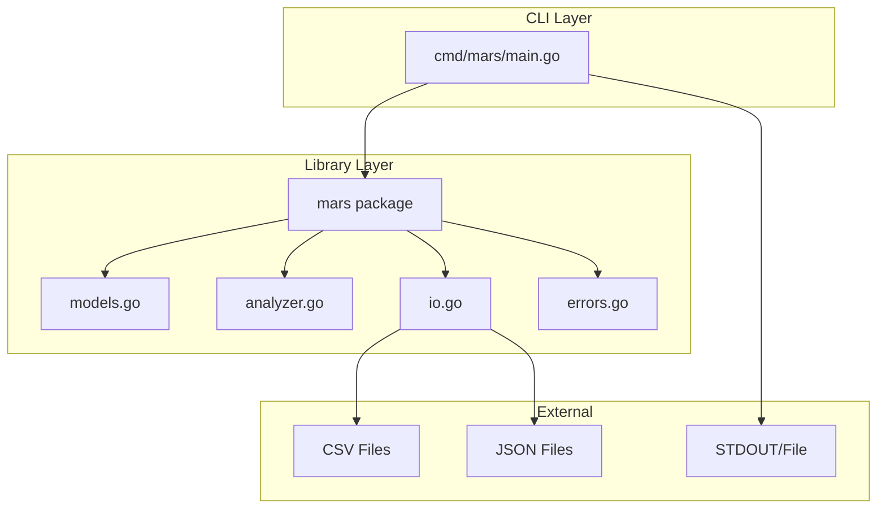
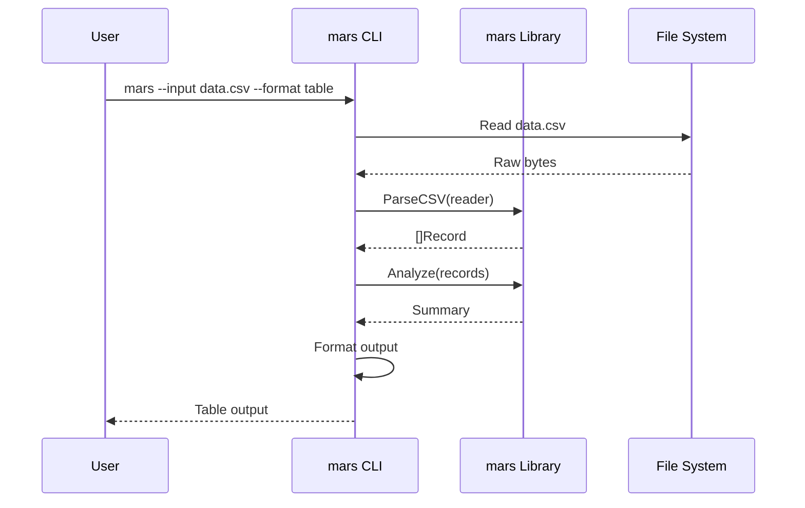
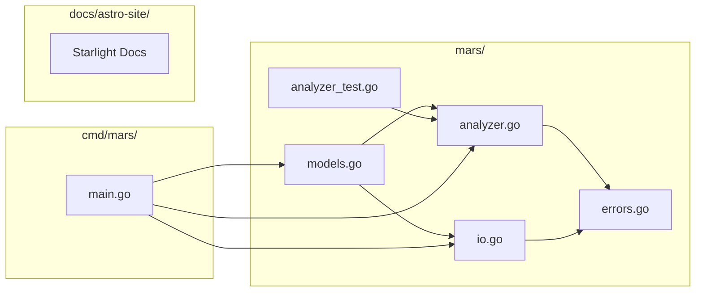

# Design

## Architecture Overview

## Data Flow

## Package Structure

## Key Design Decisions

### 1. Flat Package Structure

The `mars` library uses a single flat package rather than sub-packages. This keeps the API surface simple and discoverable. The package is small enough that sub-packages would add unnecessary nesting.

### 2. Error Handling

Sentinel errors (`ErrEmptyInput`, `ErrNilInput`, etc.) allow callers to use `errors.Is()` for precise error matching. All functions return errors rather than panicking.

### 3. Immutable Input

Analysis functions never modify input slices. `Filter` returns a new slice, and `Analyze` copies values internally. This prevents side effects and makes concurrent usage safe.

### 4. CLI as Thin Wrapper

The CLI (`cmd/mars`) is a thin wrapper around the library. All logic lives in the `mars` package, making it reusable in other Go programs.

### 5. Documentation-Driven

Documentation is treated as a first-class artifact. Starlight with `starlight-polyglot` enables both hand-written guides and auto-generated API docs from Go source.
