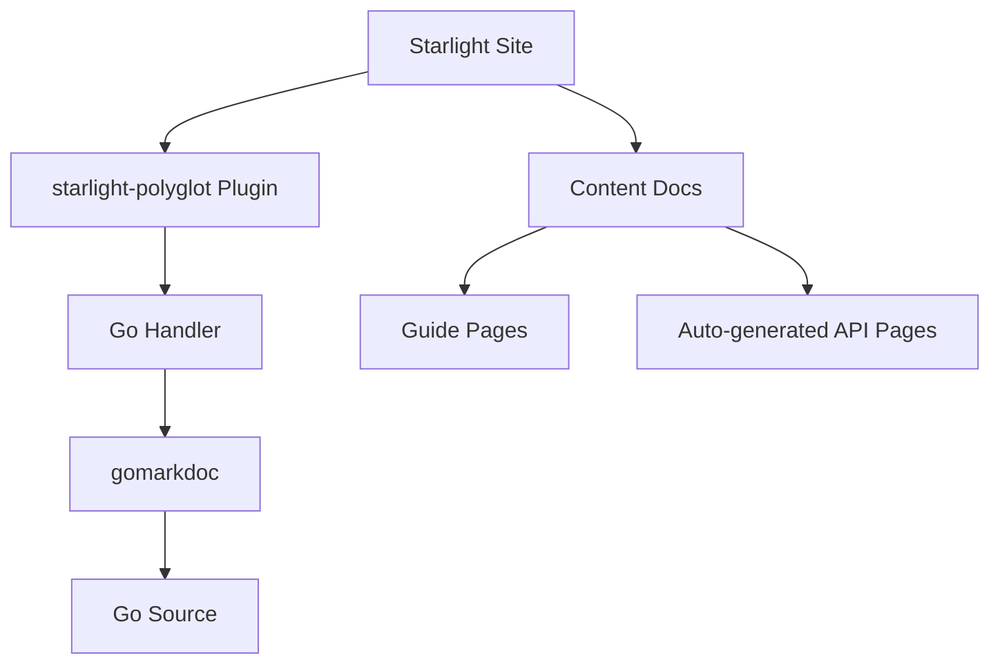

# Track: migrate_starlight

## Specification

### Objective

Set up a Starlight documentation site for the Mars Go project, integrating `starlight-polyglot` for automatic Go documentation extraction.

### Requirements

1. **Astro + Starlight setup**: Working Starlight site at `docs/astro-site/`
2. **Polyglot integration**: Configure Go handler pointing at Mars source
3. **Content**: Index, getting-started, API reference pages
4. **Deployment**: GitHub Pages via `docs.yml` workflow
5. **Custom styling**: Mars-branded theme with red accent color

### Architecture



### Configuration

The `starlight-polyglot` Go handler is configured with:

```json
{
  "handler": "go",
  "options": {
    "modulePath": "../../",
    "output": "./src/content/docs/",
    "pagination": true
  }
}
```

### Pages

| Route | Source | Description |
|-------|--------|-------------|
| `/` | index.mdx | Landing page with feature cards |
| `/getting-started/` | getting-started.mdx | Installation and usage guide |
| `/api-reference/` | api-reference.mdx | Manual API documentation |
| `/api/go/` | Auto-generated | Polyglot-extracted Go docs |

### Deployment

- GitHub Pages: `https://edithatogo.github.io/mars`
- Base path: `/mars`
- Trigger: Push to `main` with docs changes
