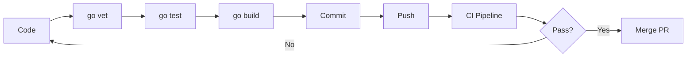

# Development Workflow

## Branch Strategy

```
main            — Production-ready code
  ├── feat/*    — Feature branches
  ├── fix/*     — Bug fixes
  ├── docs/*    — Documentation changes
  └── chore/*   — Maintenance, CI, tooling
```

## Development Loop



## PR Workflow

1. Create feature branch from `main`
2. Make changes with tests
3. Run `gofmt -l .` to check formatting
4. Run `go vet ./...` for static analysis
5. Run `go test -v ./...` for tests
6. Commit with conventional commit message
7. Open PR to `main`
8. CI runs lint, test, build matrix
9. Squash-merge after review

## Conventional Commits

```
feat: add time bucketing function
fix: correct percentile calculation for edge case
docs: update API reference with new types
chore: configure golangci-lint
ci: add Windows build target
refactor: extract filter logic into helper
test: add edge case tests for empty input
```

## Release Process

1. Check CI passes on `main`
2. Tag with `v0.x.y` (semver pre-1.0)
3. Push tag: `git push origin v0.x.y`
4. GitHub Actions builds release artifacts
5. Update documentation if needed

## Documentation Updates

Documentation is in `docs/astro-site/`. To preview locally:

```bash
cd docs/astro-site
pnpm install
pnpm run dev
```

Docs deploy automatically on push to `main` via the `docs.yml` workflow.
