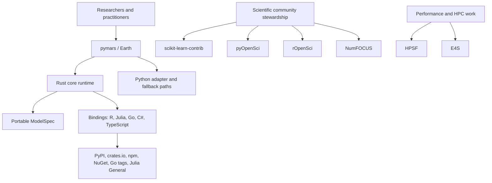
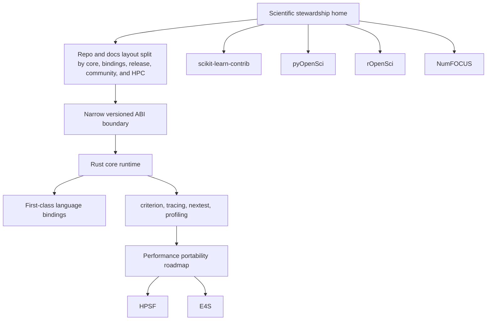

# Scientific Stewardship and HPC Roadmap

This roadmap consolidates the remaining SOTA work around scientific-community
stewardship, polyglot repository organization, ABI strategy, and HPC readiness.
It sits above the active Conductor tracks and describes the target state the
project should move toward without breaking the current public API.

## Current State

## Future State

## SOTA Gaps

- No single scientific stewardship narrative ties together the Python, R,
  Julia, Rust, Go, C#, and TypeScript surfaces.
- Community-specific readiness criteria are documented in the repo, but not yet
  consolidated into one submission matrix.
- The polyglot repository currently needs a clearer docs topology for shared
  core, language bindings, release governance, and community-facing material.
- The project has strong engineering discipline, but no formal external review
  alignment yet with pyOpenSci, rOpenSci, scikit-learn-contrib, or NumFOCUS.
- JOSS, speck, and EasyBuild are adjacent scientific venues that should be
  tracked explicitly rather than left implicit.

## HPC Gaps

- No accelerator-specific runtime path exists for GPU, TPU, or distributed
  execution.
- The Rust core has profiling and benchmarking support, but not a full HPC
  portability story.
- There is no explicit ABI layer; the current bridge strategy is CLI/FFI first
  and API compatibility is preserved through adapters.
- The project does not yet define what would make it a credible HPSF or E4S
  fit beyond packaging and benchmark hygiene.

## ABI Position

The recommended approach is a narrow, versioned ABI for stable runtime and
portable spec surfaces only, introduced without breaking the current Python
import API:

- keep `import pymars as earth` and `earth.Earth(...)`
- add ABI boundaries only where the Rust core is already authoritative
- keep host-language adapters thin and version-aware
- avoid freezing unstable training internals until parity is proven

## Roadmap Themes

1. Scientific stewardship and community readiness for scikit-learn-contrib,
   pyOpenSci, rOpenSci, NumFOCUS, JOSS, speck, and EasyBuild.
2. Polyglot repository and documentation organization for a shared Rust core
   with language-specific entry points.
3. ABI evaluation and migration strategy that preserves the existing API.
4. HPC readiness for profiling, benchmarking, portability, and future
   accelerator support.
5. Community positioning for HPSF and E4S once the performance and
   portability story is credible.

## Community Submission Readiness

| Community | What it expects | repo changes still needed |
| --- | --- | --- |
| scikit-learn-contrib | scikit-learn compatibility, clear installation story, maintained package, tests, docs, and a community-friendly governance model | submission narrative, compatibility checklist, contributor guidance, community badge/README updates |
| pyOpenSci | scientific workflow fit, reproducible testing, package scope alignment, and clear maintenance expectations | pre-submission inquiry packet, packaging/release notes, scientific workflow narrative, docs for reproducibility |
| rOpenSci | scientific R package quality, review-ready documentation, CRAN/r-universe compatibility, and maintenance commitments | submission packet, package review checklist, documentation and test alignment, release policy summary |
| NumFOCUS | project sustainability, governance, community health, and clear scientific value | stewardship narrative, governance summary, contributor model, sustainability statement |
| JOSS / speck / EasyBuild | software-paper, ecosystem-fit, and HPC packaging venues with their own submission or build expectations | paper outline, venue-fit narrative, build/packaging notes, and submission-specific checklists |

## HPC Submission Readiness

| Community | What it expects | repo changes still needed |
| --- | --- | --- |
| HPSF | performance portability, HPC ecosystem fit, profiling/tuning story, and neutral open-source stewardship | accelerator roadmap, profiling/benchmarking artifacts, portability story, performance governance |
| E4S | scientific computing relevance, performance portability, build/release reproducibility, and interoperability | CPU/GPU readiness analysis, package build integration story, portability matrix, ecosystem fit summary |

## Related Conductor Tracks

- [Linear and Notion workspace SOTA for polyglot stewardship](../conductor/tracks/linear_notion_workspace_sota_20260506/)
- [Scientific stewardship and submission readiness for polyglot scientific libraries](../conductor/tracks/scientific_stewardship_submission_readiness_20260506/)
- [SOTA HPC, ABI, and parallelism roadmap](../conductor/tracks/hpc_sota_abi_and_parallelism_roadmap_20260506/)
