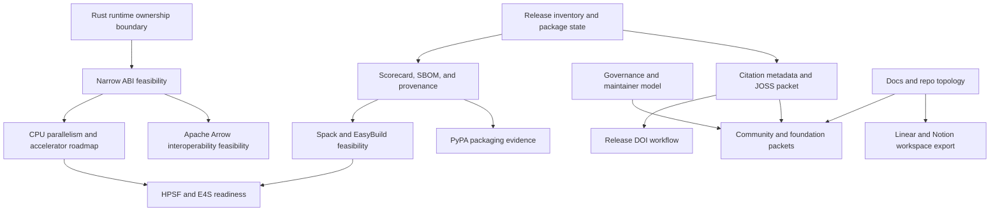

# SOTA Dependency and Parallelization Plan

This plan turns the completed SOTA, stewardship, HPC, ABI, and ecosystem
recommendations into implementation work that can be split across subagents
without stepping on the same files. It keeps the public package API stable while
making the next work concrete enough to execute.

## Dependency Graph

## Parallel Work Lanes

| Lane | Active track | Primary write scope | Depends on | Can run beside |
| --- | --- | --- | --- | --- |
| 1 | `citation_metadata_joss_packet_20260506` | `CITATION.cff`, `codemeta.json`, `paper.md`, `paper.bib`, citation docs | release inventory, package names | lanes 2, 3, 4, 6 |
| 2 | `supply_chain_scorecard_sbom_20260506` | `.github/workflows/`, `docs/supply_chain.md`, release evidence scripts | current CI manifests | lanes 1, 3, 4, 5 |
| 3 | `hpc_packaging_feasibility_20260506` | `packaging/spack/`, `packaging/easybuild/`, HPC packaging docs | release metadata, build commands | lanes 1, 2, 4, 6 |
| 4 | `abi_arrow_interop_feasibility_20260506` | `docs/binding_abi_contract.md`, Rust ABI proof docs, optional POC files | runtime ownership boundary | lanes 1, 2, 3, 5 |
| 5 | `community_governance_submission_packets_20260506` | `docs/community_submission_readiness.md`, governance docs, submission packets | lanes 1 and governance baseline | lanes 2, 4, 6 |
| 6 | `workspace_automation_export_20260506` | `docs/workspace_automation.md`, workspace export templates, Linear/Notion handoff docs | docs topology, CLI auth | lanes 1, 3, 5 |

The lanes are intentionally file-scoped. A subagent should own only its lane's
write scope and should treat other lanes as concurrent work.

## Dependency Details

| Dependency | Why it matters | Current state | Required action |
| --- | --- | --- | --- |
| Canonical package names | Submission packets, registry docs, and release evidence must agree that language distributions are named `mars-earth` while the Python import remains `pymars` | documented across release metadata and publication docs | keep this invariant in every new packet |
| Release inventory | External reviewers need a truthful package/publication state | tracked in release docs and remaining roadmap | refresh before submission packets are finalized |
| Citation metadata | JOSS, pyOpenSci, rOpenSci, and NumFOCUS-style review packets expect citation and authorship metadata | recommended but not yet committed as root metadata | add `CITATION.cff`, `codemeta.json`, `paper.md`, and `paper.bib` |
| Governance baseline | Foundation and community reviews expect a maintainer and contributor model | partially documented | add governance, code of conduct, decision, and support summaries |
| CI evidence | PyPA, OpenSSF, HPSF, and E4S readiness depends on repeatable quality gates | CI exists, but Scorecard/SBOM/provenance evidence is incomplete | add scorecard, SBOM, provenance, and release evidence workflows |
| Runtime ownership boundary | ABI and Arrow work must not freeze unstable training internals or break host APIs | documented in the Rust core boundary pages | keep ABI scope to stable runtime primitives first |
| HPC packaging commands | Spack/EasyBuild recipes need reproducible build and smoke-test commands | not yet represented as packaging recipes | produce feasibility recipes and container smoke tests |
| Workspace auth | Linear and Notion setup needs local authentication and workspace identifiers | CLI candidates are documented | export workspace taxonomy and auth-free setup instructions; keep secrets out of repo |

## External Gates

These items cannot be completed purely from source edits:

- Zenodo or equivalent DOI setup requires account-level integration.
- pyOpenSci, rOpenSci, JOSS, scikit-learn-contrib, NumFOCUS, HPSF, and E4S
  submissions require external review and may change after maintainer feedback.
- conda-forge, Spack, and EasyBuild packaging may require community repository
  review outside this repo.
- Linear and Notion synchronization requires authenticated local CLI sessions or
  app connector access.

## Execution Rules for subagents

1. Pick one lane and claim its track in `conductor/tracks.md`.
2. Read only the lane's spec, plan, and linked docs before editing.
3. Keep writes inside the lane's primary scope unless the plan explicitly names
   a shared file.
4. When a shared file must be edited, add only the lane's section and preserve
   sections owned by other lanes.
5. Run the lane's validation commands plus `uv run mkdocs build --strict`.
6. End each phase with Conductor review and apply high-confidence fixes before
   progressing.

## Roadmap Outcome

The repo should exit these tracks with:

- root citation and software-paper metadata ready for scientific review
- supply-chain evidence that supports PyPA, OpenSSF, and foundation narratives
- Spack and EasyBuild feasibility notes backed by smoke-test commands
- an API-preserving ABI and Apache Arrow decision record
- community submission packets for scikit-learn-contrib, pyOpenSci, rOpenSci,
  NumFOCUS, JOSS, PyPA, .NET Foundation, Julia, R, HPSF, and E4S
- Linear and Notion workspace exports that mirror the Conductor lanes
